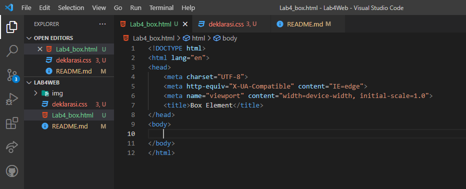
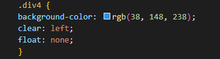

# LAB4WEB Tugas Pemoggraman Web

| Nama        | Agus sanjaya     |
| ----------  | -------------    |
| NIM         | 312010060        |
| Kelas       | TI.20.A1         |
| Matkul      | Pemograman Web   |

## Langkah-langkah Praktikum
Persiapan membuat dokumen HTML dengan nama file lab4_box.html seperti berikut. 
 

## 1. Membuat Box Element dan CSS Float Property
Kemudian tambahkan kode untuk membuat box element dengan tag div dan tambahkan deklarasi CSS pada head untuk membuat float element, seperti berikut. 
 

Dan ini hasilnya : 
 

## Mengatur Clearfix Element
Clearfix digunakan untuk mengatur element setelah float element. Property clear digunakan untuk
mengaturnya.
Tambahkan element div lainnya seteleah div3 seperti berikut. 
 

Kemudian atur property clear pada CSS, seperti berikut. 
 

Selanjutnya buka browser dan refresh kembali. 
 
Lakukan eksperimen terhadap penggunaan property clear dengan nilai lainnya (left, both, right),
dan amati perubahannya.

## 2. Membuat Layout Sederhana
Buat folder baru dengan nama lab4_layout, kemudian buatlah file baru didalamnya dengan nama
home.html, dan file css dengan nama style.css. 
 

 

Kemudian tulis kode berikut. 
 

Kemudian buka browser dan lihat hasilnya. 
 

Kemudian tambahkan kode CSS untuk membuat layoutnya. 
 

kemudian lihat hasilnya pada browser. 
 

## 3. Membuat navigasi
Kemudian selanjutnya mengatur navigasi. 
 

kemudian lihat hasilnya. 
 

## 4. Membuat Hero Fanel.
Selanjutnya membuat hero panel. Tambahkan kode HTML dan CSS seperti berikut. 
 

 

Dan ini hasilnya. 
 

## Mengatur Layout Main dan Sidebar
Selanjutnya mengatur main content dan sidebar, tambahkan CSS float. 
 

## Membuat Sidebar Widget
Kemudian selanjutnya menambahkan element lain dalam sidebar. 
 

Kemudian tambahkan CSS. 
 

Kemudian lihat hasilnya. 
 

## Mengatur Footer
Selanjutnya mengatur tampilan footer. Tambahkan CSS untuk footer. 
 

Kemudian lihat hasilnya. 
 

## Menambahkan Elemen lainnya pada Main Content
 

Kemudian tambahkan CSS. 
 
 

Lihat hasilnya dibrowser. 
 

## Menambahkan Content Artikel
Selanjutnya membuat content artikel. Tambahkan HTML berikut pada main content. 
 

Kemudian tambahkan CSS. 
 

Lihat hasilnya dibrowser. 
 

## Pertanyaan dan Tugas
1. Tambahkan Layout untuk menu About  
    => buat single layout yang berisi deskripsi, portfolio, dll
2. Tambahkan layout untuk menu Contact 
    => yang berisi form isian: nama, email, message, dll